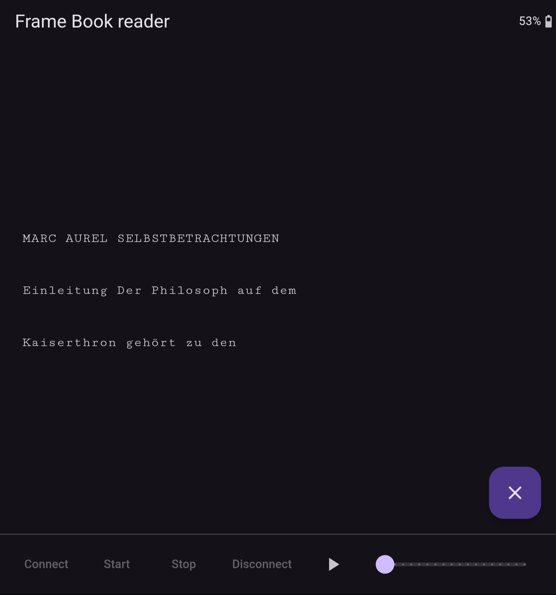

# Book reader for Frame

Simple book reader that loads a text file picked from the user's device and sends text with a typewriter effect to the frame with line scrolling.
The starting point in the text file can be set manually. The speed of the typewriter effect can be defined.

### Screenshot

### Architecture

